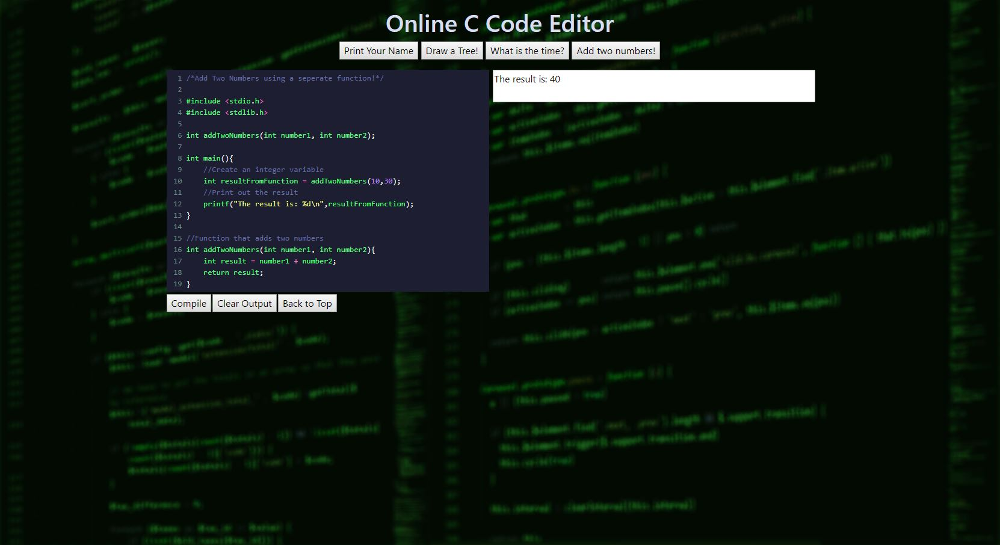
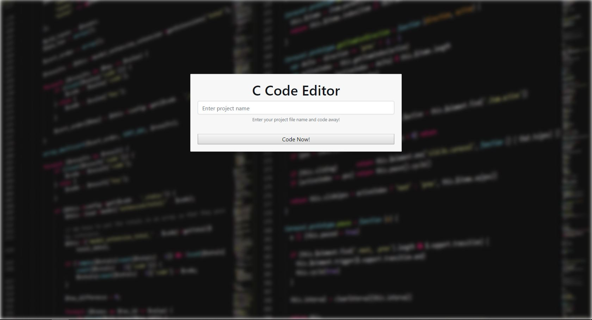

# Online C Code Editor

This is an online C Code Editor running on browser.  
Link to access: http://18.136.124.233 

Features:
- Deployed to an ec2 Windows Instance
- C++ and POCO Libraries on server side.
- CodeMirror embedded for online code editing.
- HTML, CSS and Javscript with Bootstrap for front end formatting and layout.
- GCC for C Compilation.

Projcet Structure (Important Files):

```
online_code_editor
├── Resources
|   ├── outputFile.exe // compiled executable from user's c code
|   ├── outputFile.c // input c file that user has entered in code editor
|   ├── Registration
|       ├── registration.html //registration page before coding
|
├── samples //Sample C code for users
|   ├──addTwoNumbers.c
|   ├──drawTree.c
|   ├──printName.c
|   ├──time.c
|
├── codemirror //codemirror related files
|   ├── editor.css 
|   ├── editor.html //main code editing interface for users
|   
├── images //for github readme pictures
|   ├── mainPage.jpg
|   ├── registrationPage.jpg
|
├── src //main cpp files
|   ├── main.cpp //main file
|   ├── CodeMirrorManager.cpp //For CodeMirror related requests
|   ├── CodeMirrorManager.h
|   ├── FileRender.cpp //For C Compilation Handling
|   ├── FileRender.h
|   ├── NotFound.cpp //Handles Invalid URLS
|   ├── NotFound.h
|   ├── RegistrationPage.cpp //Manages Registration Page Requests
|   ├── RegistrationPage.h
|   ├── ResourceManager.cpp //Manages Static Resources 
|   ├── ResourceManager.h
|   ├── RESTBASE.cpp //Base class that is inherited for REST Calls
|   ├── RESTBASE.h
|   ├── SamplesManager.cpp //Handles C Sample Code Requests
|   ├── SamplesManager.h

```

Main Editor



Registration page


